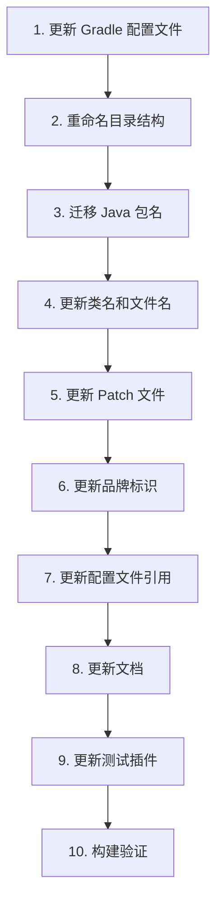

# Design Document: TRLCore Rebrand

## Overview

本设计文档描述了将 Purpur 项目全面改名为 TRLCore 的技术实现方案。改名涉及目录结构、Gradle 配置、Java 包名、品牌标识、Patch 文件、配置文件和文档等多个层面。

由于这是一个大规模的重命名操作，需要按照特定顺序执行以避免构建失败和引用断裂。

## Architecture

### 改名执行顺序



### 命名映射表

| 原名称 | 新名称 |
|--------|--------|
| `purpur` | `trlcore` |
| `Purpur` | `TRLCore` |
| `PURPUR` | `TRLCORE` |
| `purpurmc` | `trlcore` |
| `org.purpurmc.purpur` | `org.trlcore.trlcore` |
| `purpur-api` | `trlcore-api` |
| `purpur-server` | `trlcore-server` |

## Components and Interfaces

### 1. 目录结构变更

```
项目根目录/
├── trlcore-api/                    # 原 purpur-api
│   ├── src/main/java/org/trlcore/trlcore/
│   ├── paper-patches/
│   └── build.gradle.kts.patch
├── trlcore-server/                 # 原 purpur-server
│   ├── src/main/java/org/trlcore/trlcore/
│   ├── minecraft-patches/
│   ├── paper-patches/
│   └── build.gradle.kts.patch
└── test-plugin/
    └── src/main/java/org/trlcore/testplugin/
```

### 2. Gradle 配置变更

#### settings.gradle.kts
```kotlin
rootProject.name = "trlcore"
for (name in listOf("trlcore-api", "trlcore-server")) {
    val projName = name.lowercase(Locale.ENGLISH)
    include(projName)
    findProject(":$projName")!!.projectDir = file(name)
}
```

#### gradle.properties
```properties
group = org.trlcore.trlcore
version = 1.21.11-R0.1-SNAPSHOT

# GitHub Packages 认证 (本地开发时配置)
# gpr.user=your-github-username
# gpr.key=your-github-personal-access-token
```

#### build.gradle.kts
```kotlin
// GitHub Packages Maven 仓库配置
val githubActor: String = providers.gradleProperty("gpr.user")
    .orElse(providers.environmentVariable("GITHUB_ACTOR"))
    .getOrElse("")
val githubToken: String = providers.gradleProperty("gpr.key")
    .orElse(providers.environmentVariable("GITHUB_TOKEN"))
    .getOrElse("")

paperweight {
    upstreams.paper {
        patchFile {
            outputFile = file("trlcore-server/build.gradle.kts")
            patchFile = file("trlcore-server/build.gradle.kts.patch")
        }
        patchFile {
            outputFile = file("trlcore-api/build.gradle.kts")
            patchFile = file("trlcore-api/build.gradle.kts.patch")
        }
        patchDir("paperApi") {
            patchesDir = file("trlcore-api/paper-patches")
        }
    }
}

// 发布到 GitHub Packages
allprojects {
    publishing {
        repositories {
            maven {
                name = "GitHubPackages"
                url = uri("https://maven.pkg.github.com/chuyuewei/TRLCore")
                credentials {
                    username = githubActor
                    password = githubToken
                }
            }
        }
    }
}

tasks.register("printTRLCoreVersion") {
    doLast {
        println(project.version)
    }
}
```

### 3. Java 包结构变更

#### API 模块 (trlcore-api)
```
org.trlcore.trlcore/
├── entity/
│   └── StoredEntity.java
├── event/
│   ├── entity/
│   ├── inventory/
│   ├── player/
│   ├── ExecuteCommandEvent.java
│   ├── PlayerAFKEvent.java
│   └── ...
├── language/
│   └── Language.java
└── util/
    └── permissions/
        └── TRLCorePermissions.java  # 原 PurpurPermissions
```

#### Server 模块 (trlcore-server)
```
org.trlcore.trlcore/
├── command/
│   ├── TRLCoreCommand.java          # 原 PurpurCommand
│   ├── CompassCommand.java
│   └── ...
├── configuration/
├── controller/
├── entity/
│   └── TRLCoreStoredBee.java        # 原 PurpurStoredBee
├── gui/
├── item/
├── network/
├── task/
├── tool/
├── util/
├── TRLCoreConfig.java               # 原 PurpurConfig
└── TRLCoreWorldConfig.java          # 原 PurpurWorldConfig
```

### 4. 品牌标识变更

#### JAR Manifest 属性
```
Implementation-Title: TRLCore
Specification-Title: TRLCore
Specification-Vendor: TRLCore Team
Brand-Id: trlcore:trlcore
Brand-Name: TRLCore
```

#### ServerBuildInfo.java
```java
Key BRAND_TRLCORE_ID = Key.key("trlcore", "trlcore");
```

### 5. Patch 文件变更

所有 patch 文件中的注释和引用需要更新：
- `// Purpur` → `// TRLCore`
- `// Purpur start` → `// TRLCore start`
- `// Purpur end` → `// TRLCore end`
- `purpur-api` → `trlcore-api`
- `purpur-server` → `trlcore-server`

## Data Models

### 文件映射关系

```java
record FileMapping(
    String oldPath,
    String newPath,
    MappingType type
) {}

enum MappingType {
    DIRECTORY_RENAME,    // 目录重命名
    FILE_RENAME,         // 文件重命名
    CONTENT_REPLACE,     // 内容替换
    PACKAGE_MIGRATE      // 包迁移
}
```

### 需要修改的文件清单

| 文件类型 | 文件路径 | 修改类型 |
|----------|----------|----------|
| Gradle | `settings.gradle.kts` | 内容替换 |
| Gradle | `gradle.properties` | 内容替换 |
| Gradle | `build.gradle.kts` | 内容替换 |
| Patch | `trlcore-api/build.gradle.kts.patch` | 内容替换 |
| Patch | `trlcore-server/build.gradle.kts.patch` | 内容替换 |
| Patch | `trlcore-api/paper-patches/**/*.patch` | 内容替换 |
| Patch | `trlcore-server/paper-patches/**/*.patch` | 内容替换 |
| Patch | `trlcore-server/minecraft-patches/**/*.patch` | 内容替换 |
| Java | `trlcore-api/src/**/*.java` | 包迁移 + 内容替换 |
| Java | `trlcore-server/src/**/*.java` | 包迁移 + 内容替换 |
| Java | `test-plugin/src/**/*.java` | 包迁移 |
| Markdown | `README.md` | 内容替换 |
| Markdown | `CONTRIBUTING.md` | 内容替换 |

## GitHub Packages 配置

### 发布配置

项目使用 GitHub Packages 作为 Maven 仓库，发布地址为：
```
https://maven.pkg.github.com/chuyuewei/TRLCore
```

### 认证方式

1. **环境变量方式** (推荐用于 CI/CD):
   ```bash
   export GITHUB_ACTOR=your-github-username
   export GITHUB_TOKEN=your-github-personal-access-token
   ```

2. **gradle.properties 方式** (本地开发):
   ```properties
   gpr.user=your-github-username
   gpr.key=your-github-token
   ```

### 用户依赖配置

#### Gradle (Kotlin DSL)
```kotlin
repositories {
    maven {
        url = uri("https://maven.pkg.github.com/chuyuewei/TRLCore")
        credentials {
            username = project.findProperty("gpr.user") as String? ?: System.getenv("GITHUB_ACTOR")
            password = project.findProperty("gpr.key") as String? ?: System.getenv("GITHUB_TOKEN")
        }
    }
}

dependencies {
    compileOnly("org.trlcore.trlcore:trlcore-api:1.21.11-R0.1-SNAPSHOT")
}
```

#### Gradle (Groovy DSL)
```groovy
repositories {
    maven {
        url = uri("https://maven.pkg.github.com/chuyuewei/TRLCore")
        credentials {
            username = project.findProperty("gpr.user") ?: System.getenv("GITHUB_ACTOR")
            password = project.findProperty("gpr.key") ?: System.getenv("GITHUB_TOKEN")
        }
    }
}

dependencies {
    compileOnly 'org.trlcore.trlcore:trlcore-api:1.21.11-R0.1-SNAPSHOT'
}
```

#### Maven
```xml
<repositories>
    <repository>
        <id>github</id>
        <url>https://maven.pkg.github.com/chuyuewei/TRLCore</url>
    </repository>
</repositories>

<dependencies>
    <dependency>
        <groupId>org.trlcore.trlcore</groupId>
        <artifactId>trlcore-api</artifactId>
        <version>1.21.11-R0.1-SNAPSHOT</version>
        <scope>provided</scope>
    </dependency>
</dependencies>
```

Maven 用户需要在 `~/.m2/settings.xml` 中配置认证：
```xml
<servers>
    <server>
        <id>github</id>
        <username>your-github-username</username>
        <password>your-github-personal-access-token</password>
    </server>
</servers>
```

### GitHub Actions 发布工作流

```yaml
name: Publish to GitHub Packages

on:
  release:
    types: [created]
  workflow_dispatch:

jobs:
  publish:
    runs-on: ubuntu-latest
    permissions:
      contents: read
      packages: write
    steps:
      - uses: actions/checkout@v4
      - name: Set up JDK 21
        uses: actions/setup-java@v4
        with:
          java-version: '21'
          distribution: 'temurin'
      - name: Setup Gradle
        uses: gradle/actions/setup-gradle@v3
      - name: Publish package
        run: ./gradlew publish
        env:
          GITHUB_ACTOR: ${{ github.actor }}
          GITHUB_TOKEN: ${{ secrets.GITHUB_TOKEN }}
```


## Correctness Properties

*正确性属性是系统在所有有效执行中应保持为真的特征或行为——本质上是关于系统应该做什么的形式化陈述。*

由于本项目是一个大规模重命名操作，主要的正确性验证通过构建系统完成。以下是关键的正确性属性：

### Property 1: 无旧包名残留

*For any* Java 文件在 `trlcore-api/src` 和 `trlcore-server/src` 目录下，该文件不应包含 `org.purpurmc.purpur` 字符串。

**Validates: Requirements 3.1, 3.3, 3.4, 3.5**

### Property 2: 无旧命名残留在 Patch 文件

*For any* patch 文件在 `trlcore-api/paper-patches`、`trlcore-server/paper-patches` 和 `trlcore-server/minecraft-patches` 目录下，该文件不应包含 `purpur-api` 或 `purpur-server` 作为路径引用（注释中的 Purpur 历史引用除外）。

**Validates: Requirements 6.2, 6.3**

### Property 3: 构建成功

*For any* 完成重命名后的项目状态，执行 `./gradlew applyAllPatches` 和 `./gradlew build` 应成功完成。

**Validates: Requirements 10.1, 10.2**

## Error Handling

### 目录重命名失败
- 如果目标目录已存在，应先备份或报错
- 如果源目录不存在，应跳过并记录警告

### 文件内容替换失败
- 如果文件不存在，应记录警告并继续
- 如果文件权限不足，应报错并停止

### 构建失败
- 记录详细的错误信息
- 提供可能的修复建议

## Testing Strategy

### 验证方法

1. **文件存在性检查**: 验证重命名后的目录和文件存在
2. **内容搜索验证**: 使用 grep 搜索确保无旧命名残留
3. **构建验证**: 执行完整构建流程验证所有更改正确

### 验证命令

```bash
# 验证无旧包名残留
grep -r "org.purpurmc.purpur" trlcore-api/src trlcore-server/src --include="*.java"

# 验证无旧目录引用残留
grep -r "purpur-api\|purpur-server" trlcore-*/paper-patches trlcore-server/minecraft-patches --include="*.patch"

# 构建验证
./gradlew applyAllPatches
./gradlew build
```
